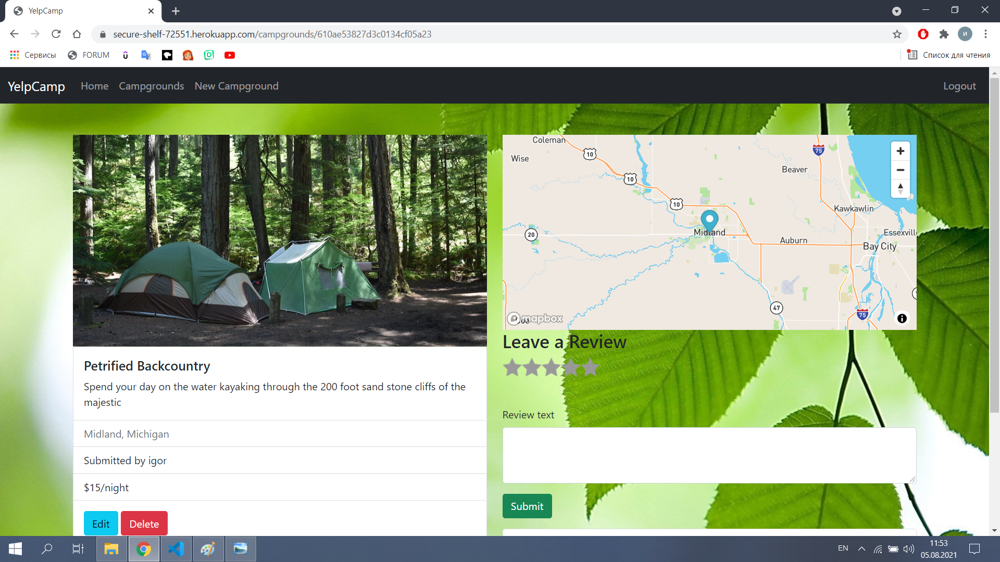
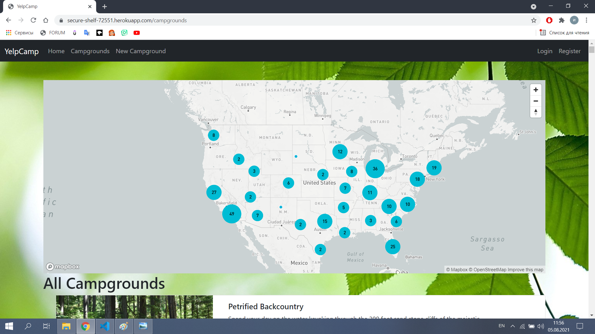

# Yelpcamp

YelpCamp is a website where users can create and review campgrounds. In order to review or create a campground, you must have an account. This project was part of Colt Steele's web dev course on udemy.
This project was created using Node.js, Express, MongoDB, and Bootstrap. Passport.js was used to handle authentication.

---

All campgrounds are displayed on the world map, users can open any campgrounds and get more detailed information about it

---
User passwords are protected by hashing using salt.The database is protected from NoSQL injection by Express Mango Sanitize.The application is partially protected from Cross Site Scripting by Joi + Sanitize Html

